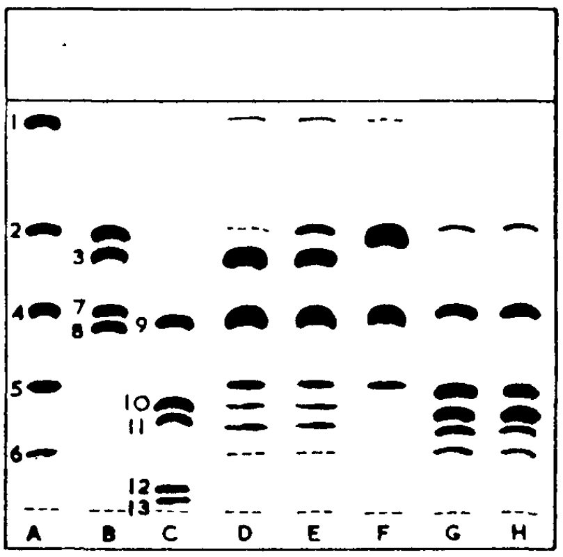

#

[88]: 10.1007/bf02822471

## Эксперимент

*Работа с пластинами*.

Глицеридные смеси наносили в виде растворов в хлороформе, 1-3 $\mu l$; 0,5%,
вдоль базовой линии, отстоящей на 2,5 см от нижнего горизонтального края
пластины. Работа проводилась по восходящей методике в закрытом резервуаре при
температуре 20-24°С в течение 80 мин со смесью четыреххлористого углерода 60 об,
хлороформа 40 об и уксусной кислоты 0,5 об, к которой добавляли различные
небольшие количества этанола в зависимости от типа глицеридов, подлежащих
разделению. Более подробно этот вопрос рассматривается ниже.

После проявления пластины высушивали в токе воздуха и опрыскивали 0,2%
этанольным раствором дибромо-R-флуоресцеина (British Drug Houses Ltd.); После
этого отделенные глицериды проявлялись в виде ярко желтые флуоресцирующие пятна
при просмотре в ультрафиолетовом освещении.

*Подготовка хроматопластов для количественного анализа*.

Хлороформные растворы глицеридов, 2 $\mu l$, 0,5%, наносили с интервалом 2,2 см
вдоль базовой линии, расположенной на расстоянии 2,5 см от нижнего
горизонтального края пластины, соблюдая при этом осторожность, чтобы не
повредить силикагельную пленку в месте нанесения. Хроматопластинки проявляли при
температуре 20-24°С в течение 80 мин в закрытых емкостях по восходящий методике
в уже описанной смеси растворителей.

После проявки пластины высушивались на воздухе и их разрезали на полоски шириной
2,2 см, каждая полоска - одна хроматограмма. Нарезка осуществлялась путем
скалывания алмазным стеклорезом с использованием линейки в качестве
направляющей; раскалывание тонких стеклянных пластинок происходило либо
самопроизвольно, либо после легкого постукивания по скалываемой линии. Полоски
равномерно опрыскивались 50% водным раствором ортофосфорной кислоты, достаточным
для смачивания силикагель, высушивались в течение 2 мин. над алюминиевым блоком
нагретым до 340°С, и помещали на блок на 5 мин.

Плотность обугленных участков измеряли на фотоденситометре "Chromoscan" (Joyee
Loebl and Co., Gateshead, England. Прибор настроен на соотношение образец/рекорд
3:1, апертура 10 - 1 плунжер, светло-серый фильтр). Для одного глицерида площадь
под кривой денситометра была пропорциональна количеству глицерида, но на площадь
влиял тип глицерида, а также в некоторой степени вариации толщины слоя
силикагеля. Чтобы компенсировать эти факторы, типичная хроматопластинка состояла
из семи хроматограмм, трех из испытуемой смеси и четырех из стандартной смеси,
состоящей из равных количеств чистых триглицеридов, расположенных поочередно.
Порядок применения поправок описано ниже.

Тонкослойная хроматография глицеридов и природных жиров на силикагель G - нитрат
серебра адсорбенте.

- A, B, C - смеси синтетических глицеридов;
- D - сало;
- E - интерэтерифицированное сало;
- F - масло какао;
- G - хлопковое масло;
- H - арахисовое масло.

1. тристеарин;
2. 2-олеодистеарин;
3. 1-олеодистеарин;
4. 1-стеародиолеин;
5. триолеин;
6. трилинолеин;
7. 2-линолеодистеарин;
8. 1-линолеодистеарин;
9. 1,3-дистеарин;
10. 1,2-длолеин;
11. 1,3-диолеин;
12. моностеарин;
13. моноолеин.
